# 👨‍💻 Abhirath Agasanakoppa

**`Full Stack Developer`**

I'm an full-stack developer building a small part of the digital world one step at a time. All of my coding projects are built from the ground up, from planning and designing all the way to solving real-life problems with code.

   <!--  

      
       -->
   

---

 

### 📊 Stats
<!--
-->

 

 

#

